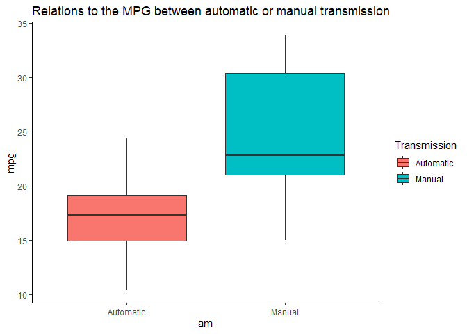
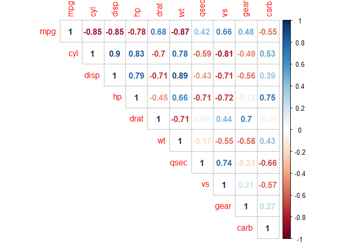
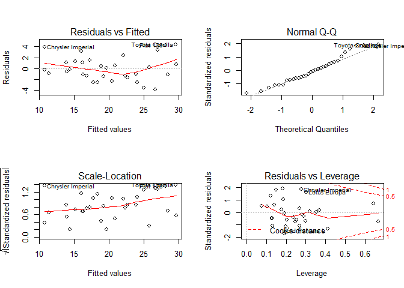
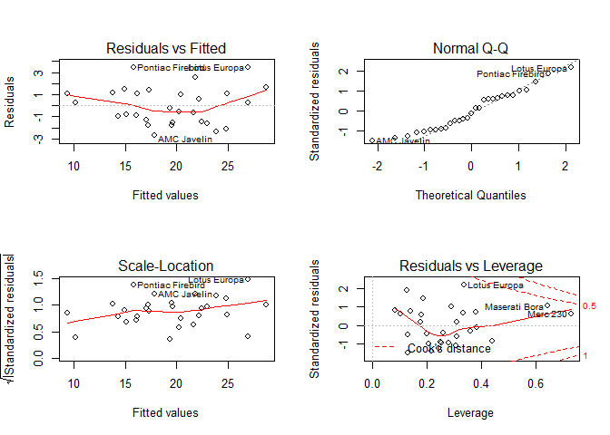
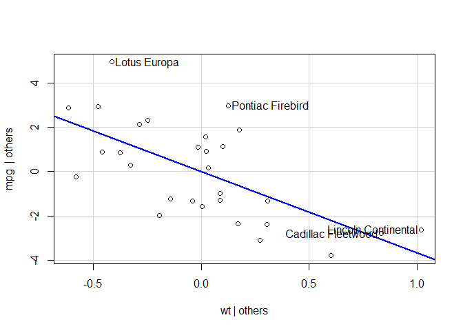

# Synopsis
Our work is conducting for 1974 Motor Trend US magazine. We are looking at a data set of a collection of cars and exploring the relationship between a set of variables and miles per gallon (MPG). We are particularly interested in the following two questions:

- Is an automatic or manual transmission better for MPG
- Quantify the MPG difference between automatic and manual transmissions

More precisely, we want to know how the MPG is related to other variables, in particular the ‘am’ variable, which defines if the vehicle has an automatic or manual transmission (based on mtcars database).

We found that the transmission type doesn't really impact to MPG. It's expectedly and significantly depends on the weight (wt).


```r
library(ggplot2)
library(ggthemes)
library(corrplot)
library(lmtest)
library(car)
data("mtcars")
head(mtcars)
```

```
##                    mpg cyl disp  hp drat    wt  qsec vs am gear carb
## Mazda RX4         21.0   6  160 110 3.90 2.620 16.46  0  1    4    4
## Mazda RX4 Wag     21.0   6  160 110 3.90 2.875 17.02  0  1    4    4
## Datsun 710        22.8   4  108  93 3.85 2.320 18.61  1  1    4    1
## Hornet 4 Drive    21.4   6  258 110 3.08 3.215 19.44  1  0    3    1
## Hornet Sportabout 18.7   8  360 175 3.15 3.440 17.02  0  0    3    2
## Valiant           18.1   6  225 105 2.76 3.460 20.22  1  0    3    1
```

## An exploratory data analysis
Let's see some basic relations to the MPG between automatic or manual transmissions by boxplot.


A data frame has 32 observations on 11 (numeric) variables:


- [, 1]	mpg	Miles/(US) gallon
- [, 2]	cyl	Number of cylinders
- [, 3]	disp	Displacement (cu.in.)
- [, 4]	hp	Gross horsepower
- [, 5]	drat	Rear axle ratio
- [, 6]	wt	Weight (1000 lbs)
- [, 7]	qsec	1/4 mile time
- [, 8]	vs	Engine (0 = V-shaped, 1 = straight)
- [, 9]	am	Transmission (0 = automatic, 1 = manual)
- [,10]	gear	Number of forward gears
- [,11]	carb	Number of carburetors


```r
mtcars$am <- as.factor(mtcars$am)
g <- ggplot(mtcars, aes(x=am, y=mpg, fill=am)) + geom_boxplot() + theme_classic()
g <- g + ggtitle("Relations to the MPG between automatic or manual transmission")
g <- g + scale_x_discrete(labels=c("Automatic","Manual"))
g <- g + scale_fill_discrete(name="Transmission",labels=c("Automatic", "Manual"))
g
```

<!-- -->


The manual transmission data is a little bit asymmetric that's why we can't provide statistical inference of basic relations correctly. But we guess that the manual transmission is relatively more impact to MPG.
Let's make a regression model for account some confounders and to provide correct statistical inference.


## Regression analysis


We examine two basic linear models: (1) with control variables and (2) without them.


(1) $mpg = \beta_{0} + \beta_{1}am + \gamma X + \varepsilon$,


(2) $mpg = \beta_{0} + \beta_{1}am + \varepsilon$,


where $X$ - a vector of controls.


According to the model (2), MPG of the manual transmission is increased by 7.245 (in average) compared to the automatic transmission (as we can see on the plot above):


```r
fit1 <- lm(mpg ~ am, data = mtcars)
summary(fit1)
```

```
## 
## Call:
## lm(formula = mpg ~ am, data = mtcars)
## 
## Residuals:
##     Min      1Q  Median      3Q     Max 
## -9.3923 -3.0923 -0.2974  3.2439  9.5077 
## 
## Coefficients:
##             Estimate Std. Error t value Pr(>|t|)    
## (Intercept)   17.147      1.125  15.247 1.13e-15 ***
## am1            7.245      1.764   4.106 0.000285 ***
## ---
## Signif. codes:  0 '***' 0.001 '**' 0.01 '*' 0.05 '.' 0.1 ' ' 1
## 
## Residual standard error: 4.902 on 30 degrees of freedom
## Multiple R-squared:  0.3598,	Adjusted R-squared:  0.3385 
## F-statistic: 16.86 on 1 and 30 DF,  p-value: 0.000285
```


Before to fit the model (2) let's conduct correlation analysis. 

```r
corrplot(cor(mtcars[sapply(mtcars,is.numeric)]), type="upper", method="number")
```

<!-- -->


As we can see there are high correlated predictors that will biase our models. So, we will remove "cyl", "disp", "gear".


```r
data <- mtcars[,c(-2,-3,-10)]
#corrplot(cor(data[sapply(data,is.numeric)]), type="upper", method="number")
fit2 <- lm(mpg ~ ., data = data)
summary(fit2)
```

```
## 
## Call:
## lm(formula = mpg ~ ., data = data)
## 
## Residuals:
##     Min      1Q  Median      3Q     Max 
## -3.8574 -1.3309 -0.2017  1.1493  4.3436 
## 
## Coefficients:
##             Estimate Std. Error t value Pr(>|t|)  
## (Intercept) 15.45592   12.28577   1.258   0.2205  
## hp          -0.01208    0.01623  -0.744   0.4641  
## drat         1.03774    1.46958   0.706   0.4869  
## wt          -2.76426    1.10159  -2.509   0.0192 *
## qsec         0.64827    0.61760   1.050   0.3043  
## vs           0.26627    1.82889   0.146   0.8855  
## am1          2.86880    1.67811   1.710   0.1003  
## carb        -0.45713    0.49929  -0.916   0.3690  
## ---
## Signif. codes:  0 '***' 0.001 '**' 0.01 '*' 0.05 '.' 0.1 ' ' 1
## 
## Residual standard error: 2.527 on 24 degrees of freedom
## Multiple R-squared:  0.8639,	Adjusted R-squared:  0.8243 
## F-statistic: 21.77 on 7 and 24 DF,  p-value: 6.053e-09
```

```r
par(mfrow = c(2,2))
plot(fit2)
```

<!-- -->

```r
shapiro.test(fit2$residuals) #p > 0.05 -> normal distrib
```

```
## 
## 	Shapiro-Wilk normality test
## 
## data:  fit2$residuals
## W = 0.95998, p-value = 0.2743
```

```r
bptest(fit2) # studentized Breusch-Pagan test if p<0.05 -> heteroskedacity is present
```

```
## 
## 	studentized Breusch-Pagan test
## 
## data:  fit2
## BP = 14.84, df = 7, p-value = 0.0381
```


if F-stat p-value < 0.05 then it's a quite good model. According to adjusted $R^2$ ~ 0.8, higher percentage of the variance is explained by our model. As we can see on the Shapiro-Wilk test, residuals of model (1) are normal distributed, so our model is quite good. But the Breusch-Pagan test shows that heteroskedacity is present. 


Plots show some outliers (Toyota Corolla, Chrysler Imperial, Fiat 128) which may be studied separately. Let's try to remove them and refit the model.


```r
data <- mtcars[c(-20,-17,-18),c(-2,-3,-10)]
#corrplot(cor(data[sapply(data,is.numeric)]), type="upper", method="number")
fit2 <- lm(mpg ~ ., data = data)
summary(fit2)
```

```
## 
## Call:
## lm(formula = mpg ~ ., data = data)
## 
## Residuals:
##    Min     1Q Median     3Q    Max 
## -2.665 -1.468 -0.194  1.098  3.432 
## 
## Coefficients:
##             Estimate Std. Error t value Pr(>|t|)    
## (Intercept) 27.71965    9.81703   2.824 0.010175 *  
## hp          -0.01997    0.01263  -1.581 0.128777    
## drat         0.48508    1.14402   0.424 0.675868    
## wt          -3.65875    0.93943  -3.895 0.000836 ***
## qsec         0.24375    0.49214   0.495 0.625543    
## vs           0.42847    1.41416   0.303 0.764884    
## am1          0.70049    1.37256   0.510 0.615127    
## carb        -0.01858    0.39434  -0.047 0.962870    
## ---
## Signif. codes:  0 '***' 0.001 '**' 0.01 '*' 0.05 '.' 0.1 ' ' 1
## 
## Residual standard error: 1.93 on 21 degrees of freedom
## Multiple R-squared:  0.8942,	Adjusted R-squared:  0.859 
## F-statistic: 25.37 on 7 and 21 DF,  p-value: 6.952e-09
```

```r
par(mfrow = c(2,2))
plot(fit2)
```

<!-- -->

```r
shapiro.test(fit2$residuals) #p > 0.05 -> normal distrib
```

```
## 
## 	Shapiro-Wilk normality test
## 
## data:  fit2$residuals
## W = 0.95505, p-value = 0.2469
```

```r
bptest(fit2) # studentized Breusch-Pagan test if p<0.05 -> heteroskedacity is present
```

```
## 
## 	studentized Breusch-Pagan test
## 
## data:  fit2
## BP = 8.1099, df = 7, p-value = 0.323
```


Now, our last model is a bit better, the residual vs fitted plot looks more linear and some coefficients are much more significant. We can't use this model for prediction, but we can conclude that the transmission type doesn't really impact to MPG. It's expectedly depends on the weight (wt).


```r
avPlots(fit2, mpg ~ wt)
```

<!-- -->


.
